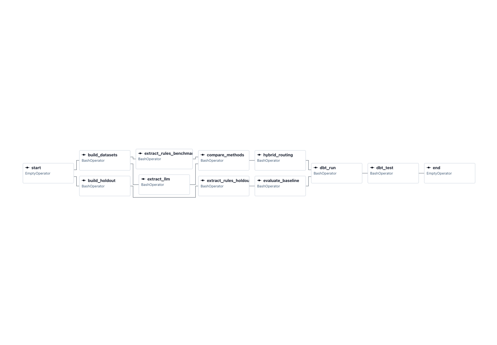

# Job Market Intelligence

**Does an LLM beat regex at reading job postings? Sometimes. I measured where.**

An extraction pipeline over 124K job postings that compares four LLM prompt
strategies against a deterministic rules baseline, field by field, with paired
significance testing — then routes each field to whichever method actually wins.

**Headline result: a hybrid policy beat LLM-only by 5.4pp (p=0.0052) while
making 36% fewer API calls.** Better *and* cheaper, because the rules and the
model fail on different postings.

---

## The finding

Every difference below is measured on the same 400 postings (paired design),
tested with McNemar's exact test and paired bootstrap confidence intervals.

| Field | Winner | Margin | p |
|---|---|---|---|
| Salary (±10%, annualised) | **Rules** | +4.1 to +5.0pp | < 0.05 |
| Correct abstention | **Rules** | +10.1 to +11.4pp | < 0.008 |
| Pay period | Tie | CI spans zero | — |
| Seniority | **LLM** | +23.1 to +30.6pp | < 0.0001 |

Two results worth sitting with:

**Free regex beat a $2.39/1k LLM at salary extraction.** Pay appears in
predictable formats, and a deterministic pattern reads it more reliably than a
probabilistic model.

**The LLM never once abstained correctly where the rules didn't.** On postings
that state no salary, the "LLM only" column is *zero* for all four prompt
variants — the model invents figures where none exist. For a labour-market
database, that is the worst available failure mode.

And the reverse, decisively: **+30.6pp on seniority.** 444 postings labelled
Entry level carry no seniority keyword in the title at all — *File Clerk*,
*Pharmacy Technician*, *Dental Assistant*. Unreachable by regex, trivial for a
model that reads the description.

### The hybrid

Conditional accuracy exposed the optimisation. On seniority, the rules are
*more* accurate than the LLM when they fire (77.6% vs 62.6%) — they just abstain
on 64% of postings. So the policy isn't "use the LLM," it's **"use the rules
when they speak, and the LLM only when they're silent."**

| Policy | Accuracy | Macro F1 | LLM calls | Cost / 1k |
|---|---|---|---|---|
| Rules only | 28.2% | 0.479 | 0 | $0.00 |
| LLM only | 58.8% | 0.613 | 294 | $2.39 |
| **Hybrid (rules first)** | **64.3%** | **0.653** | **187** | **$1.52** |

vs rules only: **+36.1pp** [+30.6, +41.8], p < 0.0001
vs LLM only: **+5.4pp** [+2.0, +9.2], p = 0.0052

The rules' *abstention* turns out to be an informative signal. Routing on it is
what produces the gain.

---

## Prompt experiment

Four strategies, same postings, same model (Claude Haiku 4.5), temperature 0.

| Variant | Seniority F1 | Salary ±10% | Valid JSON | Evidence inconsistency | Cost / 1k |
|---|---|---|---|---|---|
| zero_shot | 0.602 | 84.1% | 99.0% | 7.4% | $2.09 |
| few_shot | 0.561 | 83.5% | 99.0% | 7.1% | $2.50 |
| **schema_rules** | **0.613** | 83.2% | 98.5% | **4.2%** | $2.39 |
| decomposed | 0.515 | 83.8% | 99.8% | 12.5% | $3.20 |

`schema_rules` won — significantly better than zero_shot (+4.8pp, p=0.029) and
decomposed (+7.5pp, p=0.0007) on seniority.

That prompt was written *from the baseline error analysis*: every rule in it
corresponds to an observed regex failure on a real posting. Doing the error
analysis before touching the LLM paid for itself twice — once fixing the regex,
once writing the winning prompt.

**A designed intervention that failed:** `decomposed` asked the model to locate
evidence spans before extracting, expecting better grounding. It finished *last*
on seniority, *worst* on evidence consistency (12.5% — it quotes a salary then
returns null three times as often as schema_rules), and cost the most. Reported
because a negative result from a deliberate hypothesis is worth more than four
variants that all behaved as predicted.

**Evidence-value consistency** — cases where the model quotes supporting text
then returns null anyway — is measured rather than assumed. It appeared on the
very first test call, which is why it became a metric.

---

## Data and label quality

[LinkedIn Job Postings 2023–2024](https://www.kaggle.com/datasets/arshkon/linkedin-job-postings)
— 123,849 postings. Check the dataset page for current licence terms before reuse.

The evaluation design turns on one property: some fields carry free ground truth
and some carry none. Treating them alike would have quietly corrupted the metrics.

| Field | Label quality | Source |
|---|---|---|
| Salary, pay period | **Strong** | Structured fields, 29% coverage |
| Seniority | **Weak** | `formatted_experience_level` — inconsistent (see below) |
| Remote / hybrid / onsite | **None** | `remote_allowed` is 1-or-null; null means *unknown* |
| Years of experience, skills | **None** | Requires hand-labelling |

**The seniority label is genuinely unreliable.** Error analysis surfaced
postings tagged `YEARLY` whose text reads `$20 - $25 an hour`. A $20/year salary
does not exist. In those cases the extractor was right and the *label* was
wrong — which caps how high any method can score and is stated plainly rather
than absorbed into the numbers.

**Salary is only scored where extraction is possible.** 71% of labelled
postings actually mention pay in the prose. The rest form a separate stratum
where correct behaviour is silence — that's what makes the abstention metric
meaningful instead of rewarding a system that always guesses.

**A finding that justifies the project:** 22,417 postings state pay in the text
but carry no structured label. LinkedIn's field captures 36K; extraction from
prose recovers another 22K — a 62% increase in salary coverage.

---

## Architecture

```
Kaggle CSV (124K postings)
      │
      ├─► build_datasets.py ──► benchmark (2,000, stratified)
      │                         data_roles (1,977)
      │                         gold_seed (150)
      └─► build_holdout.py ───► holdout (2,000, zero overlap)
                                       │
        ┌──────────────────────────────┴───────────────────┐
        ▼                                                  ▼
  baselines.py                                    llm/run_experiment.py
  regex + keyword rules                           4 prompts × 400 postings
  (free, deterministic)                           (cached, provider-agnostic)
        └──────────────────────────────┬───────────────────┘
                                       ▼
                     evaluation/compare_methods.py
              paired McNemar + bootstrap CIs, per field
                                       ▼
                     evaluation/hybrid.py  ──► routing policy
                                       ▼
                     dbt: staging → intermediate → marts
                          4 models, 28 data tests
                                       ▼
                     Airflow DAG (10 tasks, weekly)
```




Stack: Python, DuckDB, dbt, Airflow 3, Anthropic API, pandas, scipy.

---

## Engineering decisions worth defending

**A holdout set exists because the baseline was tuned twice.** Error analysis
produced five regex fixes; any further gain on the same file would be tuning,
not capability. On 2,000 unseen postings the numbers held (85.4% vs 85.2%), so
the fixes generalise. Two independent draws also established a **~1.3pp sampling
noise floor** — which is precisely why differences smaller than that are not
claimed as real.

**dbt reimplements the Python metrics, and the disagreement found a bug.** The
two implementations differed on exactly one posting per variant. dbt was testing
the *annualised* salary for abstention, so a figure with an unparseable pay
period scored as a correct abstention when the model had in fact hallucinated a
number. Python was right. Cross-validating in a second language is how that
surfaced.

**Reproducibility bug that cost real money.** DuckDB's `setseed()` does *not*
make `ORDER BY random()` stable across sessions. Every pipeline run drew a
different sample, silently invalidating the LLM cache and re-billing for
extractions already paid for. Fixed three ways: order by `hash(job_id)` instead;
pin the exact sample in `config/experiment_sample.json`; and refuse to overwrite
a results file with fewer rows than it already has.

**Two conda environments.** Airflow pins dozens of dependencies and would
downgrade pandas and duckdb in the project environment, so it lives separately
and tasks invoke the project interpreter directly. This mirrors production,
where the scheduler's environment is not the task's environment.

**Cost is a first-class metric.** Tokens, latency, and dollars are recorded per
call. The conclusion of this project is a cost/quality tradeoff, so cost cannot
be an afterthought. Total spend for the full experiment: **$3.99**.

---

## Limitations

- **The data is a 2023–24 snapshot, not the current market.** It predates most
  of the GenAI hiring wave. It was chosen because it is the only public dataset
  carrying both raw description text *and* structured fields — which the
  evaluation requires. Any market claim here is historical.
- **Skills are not evaluated.** The dataset's skill taxonomy is coarse job
  *functions* (Information Technology, Analyst, Finance), not technologies, so
  it cannot serve as ground truth for SQL/Python/dbt extraction.
- **Years of experience and work arrangement are unmeasured** — no ground truth
  exists. A 150-posting hand-labelled gold set is scaffolded but not yet built.
- **Seniority ground truth is weak**, so the ceiling on that metric is unknown.
- Salary comparisons annualise hourly pay at 2,080 h/yr. Part-time roles are
  overstated by that assumption.

---

## Running it

```bash
conda create -n jmi python=3.12 -y && conda activate jmi
pip install -r requirements.txt

# Download the Kaggle dataset into data/raw/
python src/build_datasets.py
python src/build_holdout.py
python src/baselines.py --dataset holdout
python src/evaluate_baselines.py --dataset holdout

# LLM steps need ANTHROPIC_API_KEY in .env.
# Responses are cached, so re-runs are free.
python src/llm/run_experiment.py
python src/evaluation/compare_methods.py
python src/evaluation/hybrid.py

cd dbt && dbt deps && dbt run && dbt test
```

---

## Layout

```
src/
  build_datasets.py        stratified benchmark, data-role slice, gold seed
  build_holdout.py         unseen validation set
  baselines.py             regex + keyword extractors (the bar to beat)
  evaluate_baselines.py    strict metrics, annualised salary, abstention
  error_analysis.py        failure inspection — this wrote the winning prompt
  llm/
    client.py              cached, retrying, cost-tracking API client
    prompts.py             four prompt strategies
    run_experiment.py      paired runner over a pinned sample
  evaluation/
    compare_methods.py     McNemar + bootstrap, per field
    hybrid.py              routing policy comparison
dbt/                       staging → intermediate → marts, 28 tests
dags/                      Airflow DAG
config/                    pinned experiment sample
```
