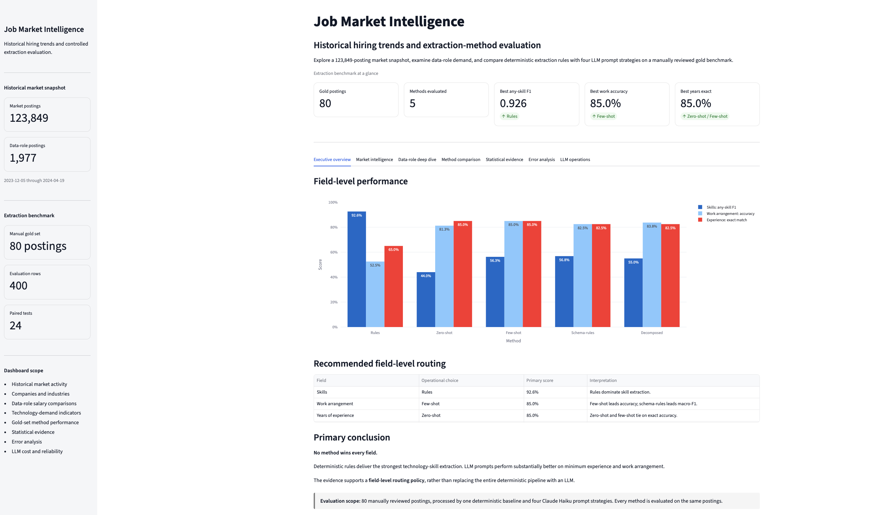
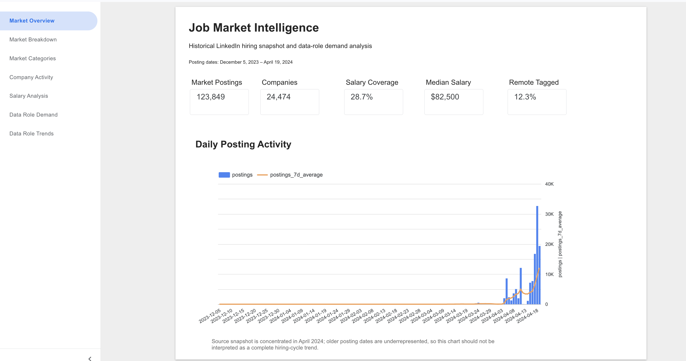

# Job Market Intelligence

[](https://github.com/nithinvenkatesh-bit/job-market-intelligence/actions/workflows/ci.yml)

**Field-level evaluation of deterministic rules and LLM prompting over job postings, paired with a historical market-intelligence layer over 123,849 LinkedIn postings.**

**Live dashboards:** [Streamlit evaluation and market dashboard](https://job-market-intelligence-nv.streamlit.app/) · [Looker Studio market dashboard](https://datastudio.google.com/reporting/077e88eb-7839-4e72-9c3c-51a75f8ed288)

The main conclusion is not that one method wins everywhere:

- **Deterministic rules win skill extraction.**
- **LLM prompts win work-arrangement and experience extraction.**
- The appropriate production design is therefore **field-level routing**, not an all-rules or all-LLM pipeline.

---

## What this project includes

- A deterministic extraction baseline for structured facts in job descriptions
- Four Claude Haiku 4.5 prompt strategies evaluated on the same postings
- An 80-posting manually reviewed gold benchmark
- Paired bootstrap confidence intervals and Holm-corrected significance tests
- Cost, latency, cache, validity, and reliability telemetry
- dbt staging, fact, and aggregate models over the full market snapshot
- Historical company, industry, salary, job-function, and data-role analysis
- Public Streamlit and Looker Studio dashboards
- Airflow orchestration, CI, regression tests, and export validation

---

## Verified gold benchmark

The primary extraction benchmark contains **80 manually annotated, difficulty-enriched postings**. Every method processed the same postings, and missing or malformed predictions count as errors.

| Method | Required-skill F1 | Preferred-skill F1 | Any-skill F1 | Work accuracy | Work macro-F1 | Years exact | Years within ±1 |
|---|---:|---:|---:|---:|---:|---:|---:|
| **Rules** | **0.813** | **0.679** | **0.926** | 52.5% | 0.356 | 65.0% | 70.0% |
| Zero-shot | 0.435 | 0.181 | 0.440 | 81.2% | 0.719 | **85.0%** | **90.0%** |
| Few-shot | 0.544 | 0.257 | 0.563 | **85.0%** | 0.755 | **85.0%** | **90.0%** |
| Schema-rules | 0.540 | 0.204 | 0.568 | 82.5% | **0.831** | 82.5% | 87.5% |
| Decomposed | 0.517 | 0.206 | 0.550 | 83.8% | 0.795 | 82.5% | 88.7% |

### Field-level conclusion

| Field | Best observed approach | Evidence |
|---|---|---|
| Skills | **Rules** | Any-skill F1 0.926; every paired LLM-vs-rules skill bootstrap interval favored rules |
| Work arrangement | **Few-shot by accuracy; schema-rules by macro-F1** | Every LLM variant significantly beat rules after Holm correction |
| Years of experience | **Zero-shot / few-shot** | 85.0% exact and 90.0% within ±1; every LLM variant significantly beat rules after Holm correction |

The skill result is driven by precision. LLM prompts frequently extract technologies mentioned in company descriptions, team stacks, or contextual prose rather than only candidate requirements. The deterministic extractor is narrower and better aligned with the gold labels.

For work arrangement and years of experience, the reverse pattern holds: these fields often require reading context spread across the description rather than matching a compact keyword list.

Prompt-to-prompt differences were smaller than method-family differences. On the 76 non-ambiguous work-arrangement items, no prompt-vs-prompt comparison survived Holm correction.

> The gold sample deliberately overrepresents difficult postings. Treat these figures as a stress test, not as a representative estimate of all LinkedIn postings.

---

## Earlier provider-label routing experiment

Before the manual gold set was completed, the project ran a separate 400-posting experiment against provider-supplied reference fields for salary, pay period, and seniority.

That experiment found that a **rules-first seniority policy** reached **64.3% accuracy**, compared with **58.8% for LLM-only**, while making **36% fewer LLM calls**. The paired improvement was **+5.4 percentage points** with a 95% bootstrap interval of **+2.0 to +9.2 points** and McNemar exact **p = 0.0052**.

This remains useful as an operational routing result, but it is **not the primary accuracy benchmark** because the provider seniority labels are known to be noisy. The manually reviewed 80-posting benchmark above is the main field-level evaluation.

---

## Historical market intelligence

The market layer analyzes the public LinkedIn Job Postings 2023–2024 snapshot.

| Measure | Result |
|---|---:|
| Valid unique postings | **123,849** |
| Posting dates represented | **December 5, 2023 – April 19, 2024** |
| Companies with IDs | **24,474** |
| Valid salary postings | **35,543** |
| Salary coverage | **28.7%** |
| Median annualized salary | **$82,500** |
| Salary interquartile range | **$52,000 – $125,000** |
| Remote-tagged postings | **12.31%** |

`remote_allowed` is one-or-null in the source. The dashboard therefore labels 12.31% as **remote tagged** and does not interpret null values as onsite.

The source snapshot is concentrated in April 2024. Calendar-spine marts retain dates with zero observed postings, but the trend charts should still be read as source-snapshot activity rather than a complete longitudinal hiring census.

### Data-role deep dive

A deterministic title taxonomy identifies **1,977 postings across seven data-role families** from March 6 through April 19, 2024.

| Role family | Postings | Median salary |
|---|---:|---:|
| Business Analyst | 535 | $102,000 |
| Data Analyst | 430 | $100,000 |
| Data Engineer | 411 | $140,000 |
| Data Scientist | 338 | $166,700 |
| BI Analyst | 214 | $120,000 |
| Product Analyst | 26 | $83,000 |
| Analytics Engineer | 23 | $167,500 |

Analytics Engineer has only 13 salary-bearing postings, so its median is especially uncertain.

### Technology mentions in data-role descriptions

| Technology | Posting share |
|---|---:|
| SQL | **51.2%** |
| Python | **41.4%** |
| Excel | **21.7%** |
| AWS | **18.9%** |
| Power BI | **18.5%** |
| Azure | **16.0%** |
| Tableau | **15.5%** |

These are deterministic **description mentions**, not manually verified required skills. They should not be interpreted as causal salary drivers or exact employer requirements.

---

## Live dashboards

### Streamlit

[Open the public Streamlit dashboard](https://job-market-intelligence-nv.streamlit.app/)



The Streamlit application combines:

- Executive evaluation summary
- Market intelligence
- Data-role deep dive
- Method comparison
- Statistical evidence
- Error analysis
- LLM operations and cost

The deployment reads committed, validated JSON exports and does not require API credentials at runtime.

### Looker Studio

[Open the public Looker Studio dashboard](https://datastudio.google.com/reporting/077e88eb-7839-4e72-9c3c-51a75f8ed288)



The seven-page BI report covers:

1. Market Overview
2. Market Breakdown
3. Market Categories
4. Company Activity
5. Salary Analysis
6. Data Role Demand
7. Data Role Trends

---

## Architecture

```text
LinkedIn job-posting CSVs
          |
          +-------------------------------+
          |                               |
          v                               v
Python dataset builders             dbt external sources
benchmark / holdout / gold          postings / companies /
data-role slice                     skills / industries
          |                               |
          v                               v
Rules baseline + 4 prompts          staging tables
          |                               |
          v                               v
Manual-gold scoring                 market fact tables
paired bootstrap + tests            aggregate marts
          |                               |
          +---------------+---------------+
                          |
                          v
                 validated exports
             JSON for Streamlit / CSV for BI
                          |
               +----------+----------+
               |                     |
               v                     v
         Streamlit Cloud        Looker Studio
```

The broader project also includes an Airflow DAG for scheduled pipeline execution and an earlier provider-reference experiment used to test routing and cost tradeoffs.


**Stack:** Python, DuckDB, dbt, Airflow 3, Anthropic API, pandas, scipy, Plotly, Streamlit, Looker Studio.

---

## Reproducibility and validation

The final project state has been checked at multiple layers:

- **57/57 Python tests passed**
- **89/89 dbt build nodes passed**
- Evaluation dashboard export validation passed
- **181/181 market-export checks passed**
- Streamlit and Looker exports reconcile to the dbt marts
- Complete calendar spines preserve zero-posting dates
- Dashboard exports exclude raw descriptions, API keys, passwords, and other banned fields
- Dashboard JSON files remain below deployment-size limits
- The malformed schema-rules response is retained as an invalid prediction and scored as incorrect

### Engineering decisions worth defending

**The gold set is independent of extractor output.** The annotation workflow begins blank rather than pre-filling rule predictions, records whether the annotator viewed a model guess, and stores time-on-item for auditability.

**Missing predictions are errors.** A malformed response is not silently dropped from a denominator.

**Skill and classification metrics are separated.** Entity-level precision, recall, and F1 are used for skills; accuracy and macro-F1 are used for work arrangement; exact, within-one-year, and MAE metrics are used for experience.

**Multiple comparisons are controlled.** Work-arrangement and experience comparisons use paired tests with Holm correction. Skill comparisons use paired bootstrap confidence intervals rather than unsupported p-value claims.

**Calendar spines are explicit.** Daily market and role-family marts include zero-posting dates, preventing rolling averages from becoming observed-date averages.

**Cost is a first-class output.** The API client records tokens, latency, cache state, attempts, and estimated dollars per call.

**The runtime is privacy-minimized.** Public dashboard exports contain aggregates and evaluation outputs, not job descriptions or raw model responses.

---

## Data quality and limitations

- This is an **offline benchmark**, not an online A/B test.
- The market data is a **historical 2023–2024 snapshot**, not the current job market.
- The 80-posting gold set is **difficulty-enriched** and not prevalence representative.
- The earlier 400-posting routing experiment uses **provider reference labels**, not manual gold.
- Remote status is **remote tagged versus unknown**; unknown is not equivalent to onsite.
- Salary metrics use the source `normalized_salary`, USD rows, annualized supported pay periods, and a $10,000–$500,000 validity range.
- Industry relationships can be many-to-many, so industry posting totals should not be summed to reconstruct the market total.
- Broad source skill categories are LinkedIn job-function classifications, not technology skills.
- Technology demand uses deterministic description mentions and may include contextual mentions.
- Small role families and low salary support produce volatile median estimates.
- No causal conclusion should be drawn from salary differences across roles, industries, or technologies.

Dataset: [LinkedIn Job Postings 2023–2024](https://www.kaggle.com/datasets/arshkon/linkedin-job-postings). Check the dataset page for current license terms before reuse.

---

## Run locally

```bash
conda create -n jmi python=3.12 -y
conda activate jmi
pip install -r requirements.txt

# Download the Kaggle source files into data/raw/
python src/build_datasets.py
python src/build_holdout.py

# Deterministic extraction and evaluation
python src/baselines.py --dataset holdout
python src/evaluate_baselines.py --dataset holdout

# LLM execution requires ANTHROPIC_API_KEY in .env
python src/llm/run_experiment.py

# Evaluation
python src/evaluation/compare_methods.py
python src/evaluation/hybrid.py

# dbt
cd dbt
dbt deps
dbt build
cd ..

# Dashboard exports and checks
python dashboard/export_data.py
python dashboard/export_market_data.py
python dashboard/validate_dashboard.py
python dashboard/validate_market_data.py
PYTHONPATH=. pytest -q

# Local application
streamlit run dashboard/app.py
```

Responses are cached using a hash of the model and prompt. Re-running an unchanged request can reuse the cached result rather than generating another API charge.

For a dashboard-only installation:

```bash
pip install -r dashboard/requirements.txt
streamlit run dashboard/app.py
```

---

## Project layout

```text
src/
  build_datasets.py             benchmark, holdout inputs, data-role slice
  build_holdout.py              unseen deterministic validation sample
  baselines.py                  regex and keyword extractors
  error_analysis.py             failure inspection
  llm/
    client.py                   cached, retrying, cost-tracking API client
    prompts.py                  four prompt strategies
    run_experiment.py           paired LLM runner
  evaluation/
    compare_methods.py          paired tests, bootstrap intervals, Holm
    hybrid.py                   routing-policy comparison

dbt/
  models/staging/               durable source tables
  models/intermediate/          shared transformations
  models/marts/                 evaluation and market-intelligence marts
  seeds/                        deterministic technology patterns

dashboard/
  app.py                        Streamlit entry point
  market_tabs.py                historical market and data-role views
  data_loader.py                validated JSON loader
  export_data.py                evaluation-dashboard exports
  export_market_data.py         market-dashboard and Looker exports
  validate_dashboard.py         evaluation export checks
  validate_market_data.py       181 market export checks
  data/                         committed public dashboard JSON

looker_studio/data/             committed aggregate CSV exports
dags/                           Airflow orchestration
docs/                           annotation guide and project artifacts
tests/                          regression and evaluation tests
config/                         pinned experiment configuration
```

---

## License

Project code is released under the [MIT License](LICENSE). The LinkedIn/Kaggle
dataset and artifacts derived from it remain subject to their original terms
and are not relicensed by this repository.

---

## Central takeaway

**Use the cheapest method that is empirically strongest for each field.**

For this project:

- Rules are the right default for skills.
- LLM prompting is substantially better for work arrangement and experience.
- Prompt complexity alone does not guarantee better extraction.
- Gold-label quality and paired evaluation matter more than impressive-looking raw output.
